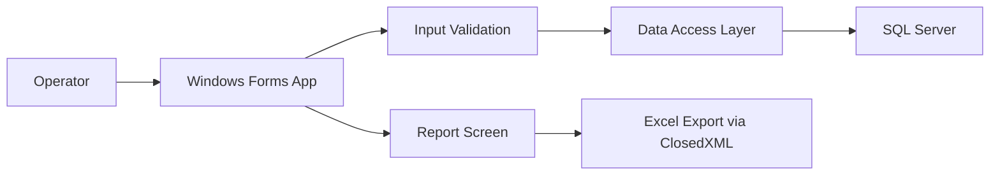

# Eyesight Record Management System

Portfolio case study for an internal Windows desktop application used to record employee eyesight screening results and generate monthly reports.

> This repository is a sanitized portfolio version. It does not include company data, production connection strings, internal IP addresses, employee records, proprietary database schema, compiled binaries, or deployment artifacts.

## Overview

The project was built to replace manual eyesight record tracking with a structured desktop workflow. Operators can validate employee information, choose production line and shift period, record eyesight screening results, and export monthly reports to Excel.

## My Role

- Designed and developed the Windows Forms application in C# and .NET 8.
- Implemented form validation and operator-friendly data entry flow.
- Integrated SQL Server queries and stored procedure calls.
- Built monthly report search and Excel export using ClosedXML.
- Prepared ClickOnce-style deployment output for internal use.

## Key Features

- Employee lookup and validation before saving records.
- Line and shift-period selection with database-backed dropdowns.
- Duplicate-aware data entry flow for repeated operational use.
- Monthly report filtering by year, month, and section.
- Excel report generation from a template with ClosedXML.

## Tech Stack

- C#
- .NET 8
- Windows Forms
- SQL Server
- ClosedXML

## What Is Included

- Sanitized case-study documentation.
- Architecture notes.
- Redacted sample code that demonstrates the implementation approach without exposing real company details.
- A safety checklist for preparing public portfolio repositories.

## What Is Not Included

- Production source code with internal identifiers.
- Real database names, table names, function names, stored procedure names, IP addresses, usernames, or passwords.
- Employee data or screenshots containing real personal information.
- Excel templates that may contain company formatting or data.
- Build output such as `.exe`, `.dll`, `bin/`, `obj/`, or publish folders.

## Architecture Summary

## Portfolio Notes

This project demonstrates practical desktop application development for an operational workflow: form design, validation, database access, reporting, and Excel generation. The public version is intentionally documentation-focused to protect confidential company systems.

## Suggested 

Developed a C#/.NET 8 Windows Forms application for employee eyesight screening records, including SQL Server integration, form validation, monthly reporting, and Excel export automation with ClosedXML.
