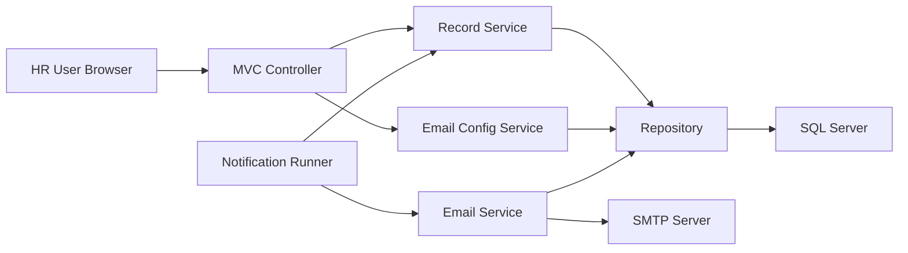
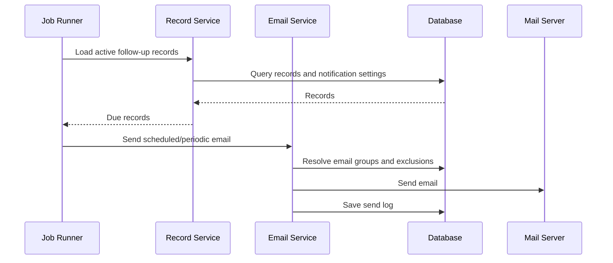

# SubstanceSys Case Study

## Overview

SubstanceSys เป็นระบบ HR สำหรับบันทึกและติดตามรายการ follow-up พร้อมระบบแจ้งเตือนอีเมลอัตโนมัติ ผู้ใช้สามารถกำหนดช่วงติดตาม วัน/เวลาแจ้งเตือน รอบการแจ้งเตือน และกลุ่มผู้รับอีเมลได้

เอกสารนี้เป็นเวอร์ชัน public-safe จึงตัดข้อมูลบริษัท ข้อมูลพนักงาน และรายละเอียด production ออกทั้งหมด

## Problem

งาน follow-up ของ HR ต้องมีการบันทึกข้อมูล ตรวจสอบช่วงวันที่ไม่ให้ซ้ำ ติดตามผลตามรอบเวลา และแจ้งเตือนไปยังผู้เกี่ยวข้อง ระบบเดิมต้องลดงาน manual และเพิ่ม audit trail สำหรับการส่งอีเมล

## My Role

- พัฒนา MVC flow สำหรับ list/create/update/delete/confirm follow-up records
- เพิ่ม validation ไม่ให้ช่วงวันที่ follow-up ของพนักงานซ้ำกัน
- พัฒนา email notification service ด้วย MailKit/MimeKit
- ออกแบบ email group configuration สำหรับ TO, CC และ EXCLUDE
- เพิ่ม scheduled และ periodic notification runner
- เพิ่ม schema initializer สำหรับสร้าง/ปรับปรุง table ที่ระบบต้องใช้
- เพิ่ม email send log เพื่อ audit การส่งอีเมล

## Tech Stack

- ASP.NET MVC / C#
- SQL Server
- Dapper
- MailKit / MimeKit
- Background job style runner
- Razor views + AJAX endpoints

## Architecture



## Main Features

- Follow-up record management
- Date range validation
- Confirmation status for returned/resigned outcome
- Email groups: TO, CC, EXCLUDE
- Cross-group conflict warning
- Scheduled notification by date/time
- Periodic notification by interval
- Email send logging with SUCCESS/FAILED/SKIPPED status
- Database schema initialization and migration helper

## Notification Flow



## Key Engineering Decisions

- แยก record service, email config service และ email service เพื่อลด coupling
- Normalize employee code และ group code ก่อน validate/save
- ตรวจ duplicate และ cross-group conflict ก่อนบันทึก email config
- ใช้ include/exclude recipient set เพื่อควบคุมผู้รับอีเมลอย่างชัดเจน
- บันทึก email log ทุกกรณีสำคัญเพื่อช่วยตรวจสอบ production issue
- รองรับทั้ง scheduled notification และ periodic fallback flow

## Public-Safe Data Model

```text
FollowUpRecord
  - Id
  - EmployeeReference
  - FollowUpStartDate
  - FollowUpEndDate
  - ConfirmationStatus
  - NotificationSetting

NotificationSetting
  - NotifyDate
  - NotifyTime
  - IntervalValue
  - IntervalUnit
  - ToGroup
  - CcGroup
  - ExcludeGroup

EmailSendLog
  - RecordId
  - SendType
  - SendStatus
  - JobName
  - SentAt
```

## What Was Sanitized

- Employee code, employee name, email, department, position
- SMTP host/user/password
- Internal phone number and email template details
- Real table names and migration scripts
- Internal business process labels

## Portfolio Talking Points

- Built a configurable HR notification workflow with audit logging
- Implemented date validation and duplicate prevention for follow-up records
- Designed recipient group management with TO/CC/EXCLUDE behavior
- Added scheduled and interval-based background processing
