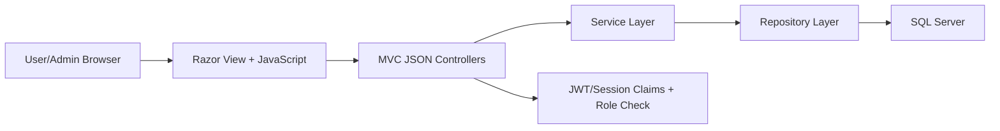
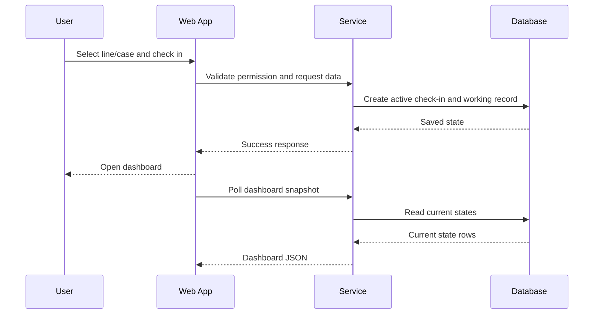

# WorkStatePE Case Study

## Overview

WorkStatePE เป็นระบบสำหรับติดตามสถานะการทำงานของพนักงานในพื้นที่ production โดยมีเป้าหมายให้ผู้ใช้งาน check-in เข้า line/case ที่กำลังทำงาน และให้ admin เห็นภาพรวมสถานะแบบ dashboard

เอกสารนี้เป็นเวอร์ชัน public-safe จึงอธิบายเฉพาะ architecture และ engineering approach โดยไม่เปิดเผยข้อมูล production จริง

## Problem

ทีมต้องการระบบที่ช่วยให้เห็นว่าแต่ละคนกำลังทำงานอยู่ที่ line/case ใด ใครอยู่สถานะ standby หรือ leave และต้องสามารถตรวจสอบย้อนหลังหรือ export รายงานได้ โดย flow ต้องรองรับทั้งผู้ใช้ทั่วไปและ admin

## My Role

- วิเคราะห์ requirement และแยก flow สำหรับ user/admin
- ออกแบบโครงสร้าง Controller-Service-Repository
- พัฒนา API สำหรับ dashboard snapshot, checkout, status update และ export
- วาง business rule เรื่อง permission และ check-in requirement
- แยก view สำหรับ dashboard และ admin management
- ทำ Selenium automation tests สำหรับ smoke/admin UI scenarios
- จัดทำเอกสาร handover และ test guide

## Tech Stack

- ASP.NET MVC / C#
- SQL Server
- Dapper
- Razor views
- JavaScript / AJAX polling
- Bootstrap/AdminLTE style
- Selenium WebDriver console runner

## Architecture

## Main Features

- Login integration และ role-based access
- Check-in เข้า line/case
- Check-out พร้อมคำนวณ working minutes
- Dashboard snapshot แสดง employee cards, line board, summary status
- Admin-only manual status update
- Export dashboard rows
- Admin CRUD สำหรับ master data ที่เกี่ยวข้อง
- Selenium smoke test และ admin UI test runner

## Key Engineering Decisions

- ใช้ Controller-Service-Repository เพื่อแยกหน้าที่ของ routing, business logic และ SQL access
- ใช้ parameterized SQL ผ่าน Dapper เพื่อลดความเสี่ยงจาก SQL injection
- ตรวจ permission ฝั่ง backend เสมอ ไม่พึ่ง frontend guard อย่างเดียว
- ให้ user ต้องมี active check-in ก่อนดู dashboard แต่ admin สามารถ monitor ได้โดยไม่ต้อง check-in
- แยก automation test project ออกจาก web project หลักเพื่อไม่ deploy test code ไปกับ production

## Public-Safe Flow

## Testing Strategy

- Smoke test: login page and WorkStatePE routes
- Auth test: valid test account login
- Check-in test: line/case selection and submit flow
- Admin UI test: open add/edit modal, dropdown interaction, delete confirmation cancel
- Admin dashboard test: status update with restore behavior

## What Was Sanitized

- Employee identifiers and personal data
- Internal URLs and image paths
- Real database/table detail beyond generic explanation
- Credentials and environment settings
- Business-sensitive wording

## Portfolio Talking Points

- Built a production-facing dashboard workflow with role-based controls
- Designed a maintainable layered architecture in a legacy ASP.NET MVC application
- Added UI automation to reduce manual regression effort
- Balanced real-time visibility with permission and data safety rules
